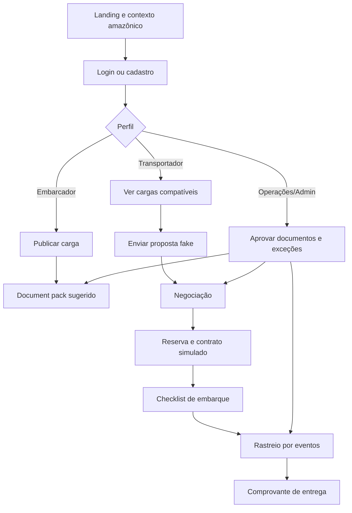

# HydroRivers — arquitetura e contexto de produto

## Nível atual da aplicação

A aplicação está no nível de **MVP transacional demonstrável**. Ela simula cadastro, login, publicação de cargas, filtros, propostas, negociação, rastreio e valor governamental com mock server-side. Ainda não é produção real porque não tem banco transacional, autorização profunda, auditoria, integrações oficiais ou rastreio em tempo real.

## Perfis que fazem sentido

- **Embarcador / cooperativa**: publica cargas, acompanha propostas, documentação e janela de embarque.
- **Transportador / armador**: encontra cargas compatíveis por corredor, calado, capacidade e documentação.
- **Operações / compliance**: acompanha documentos, exceções, aprovação de embarcações e risco operacional.
- **Admin governamental ou institucional**: enxerga corredores, abastecimento, sociobioeconomia, previsibilidade e gargalos.
- **Tripulação / campo**: futuramente registra eventos, evidências, checklist e sincronização tardia.

## Fluxograma de negócio mockado

## Próximo salto para produção

- Auth real com provider ou passkeys.
- Postgres/Supabase/Neon + migrations.
- Zod para schemas de payload.
- Autorização por owner/role.
- Storage real para avatar/documentos.
- Mapa, ETA operacional e eventos em tempo real.
